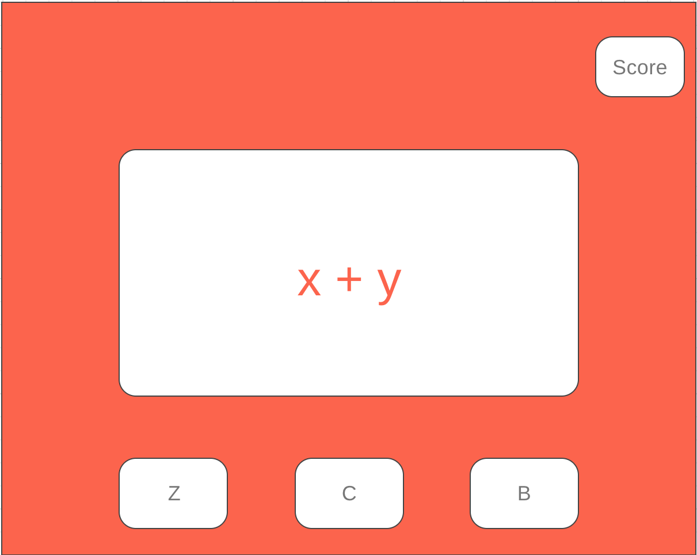
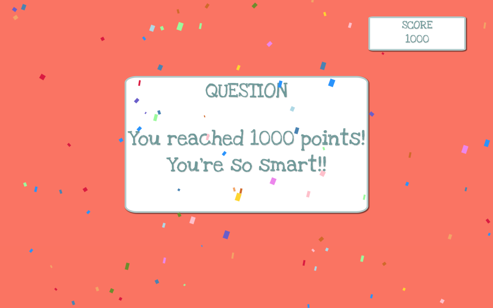

# Math Game for Kids

### Objective
This game is intended to educate young children in  basic mathematics through positive reinforcement.

### Wireframe:

### Screenshot:

### Technologies Used:
- JavaScript; 
- HTML; and
- CSS.

### Getting Started:
The first page of the site is a scoreboard set to 0 points, a display screen, and three buttons on the bottom. An equation is shown with three answer choices below. Each answer choice corresponds to the buttons below, denoted with "a", "b", and "c". The user answers the question to the best of her or his ability.

If the answer is correct, users are treated to a cheerful sound effect, 100 points are added to the score in the top right, and a new equation and answer choices are displayed.

If the user answers incorrectly, the button that corresponds to the incorrect answer is removed. The user is then given another chance to find the correct answer. This process continues until the correct answer is chosen. This approach allows for users to learn in a positive environment, and outside of their grade-level since equations cover mulitplication and division, as well as addition and substraction.

Once the user correctly answers ten questions, the user is treated to confetti and cheerful mariachi music. The user must reload the page to start a new game.

### User Stories:
As a user I want to learn basic math operations in a positive environment.
As a user I want second chances to answer questions.
As a user I want to learn through repitition.

### Stretch Goals:
- Add a feature where mutiple equations appear and users must solve them as quickly as possible.
- Add a timer for each equation.
- Put multiple choice options in the buttons themselves.
- Randomize equations through template literals and advanced game logic.

[//] # (Deployed Site: http://kids_game.surge.sh/)
